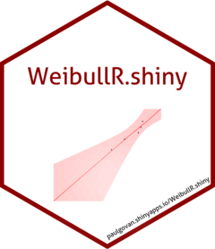

```{r setup, include=FALSE}
knitr::opts_chunk$set(echo = TRUE)
```

# ReliaShiny <a href="https://paulgovan.github.io/ReliaShiny/"></a>

<!-- badges: start -->
[](https://CRAN.R-project.org/package=ReliaShiny)
[](https://github.com/paulgovan/WeibullR.shiny/actions/workflows/R-CMD-check.yaml)
[](https://cran.r-project.org/package=ReliaShiny)
[](https://cran.r-project.org/package=ReliaShiny)
[](https://lifecycle.r-lib.org/articles/stages.html#stable)
[](https://doi.org/10.32614/CRAN.package.ReliaShiny)
<!-- badges: end -->

# Introduction

**Welcome to ReliaShiny!** ReliaShiny is an interactive web application for reliability analysis. The app is built using the [shiny](https://shiny.rstudio.com/) package in R. ReliaShiny provides an easy-to-use interface for performing reliability analysis using the [WeibullR](https://cran.r-project.org/package=WeibullR) and [ReliaGrowR](https://cran.r-project.org/package=ReliaGrowR) packages in R.

# Getting Started 

To install `ReliaShiny` in R:

```{r, eval=FALSE}
install.packages("ReliaShiny")
```

To install the development version:

```{r, eval=FALSE}
devtools::install_github("paulgovan/ReliaShiny")
```

To launch the app: 

```{r, eval=FALSE}
ReliaShiny::ReliaShiny()
```

{width=100%}

Or to access the app through a browser, visit [govan.shinyapps.io/reliashiny/](https://govan.shinyapps.io/reliashiny/).

## Code of Conduct

Please note that the ReliaShiny project is released with a [Contributor Code of Conduct](https://paulgovan.github.io/ReliaShiny/CODE_OF_CONDUCT.html). By contributing to this project, you agree to abide by its terms.
