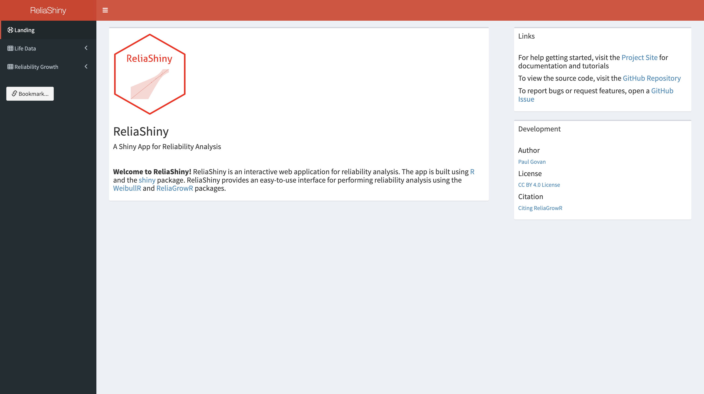
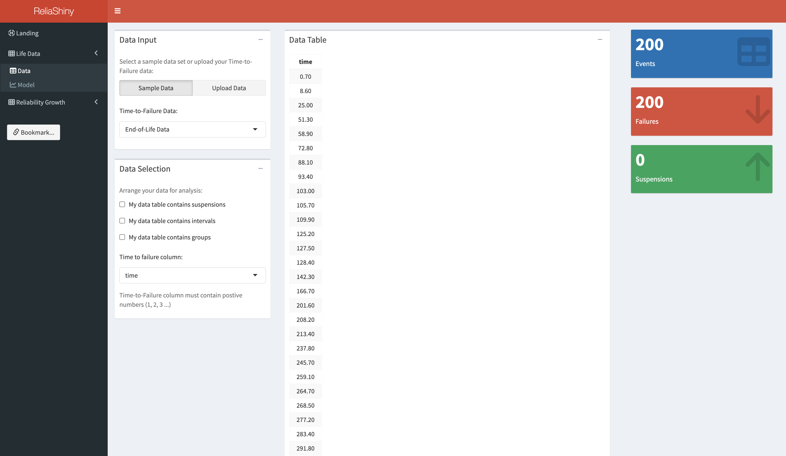
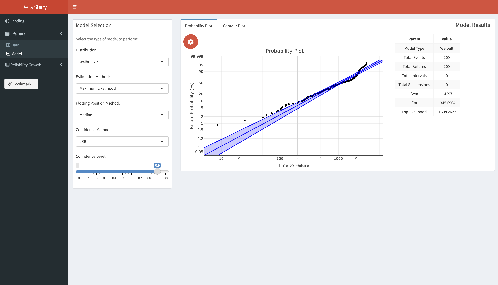
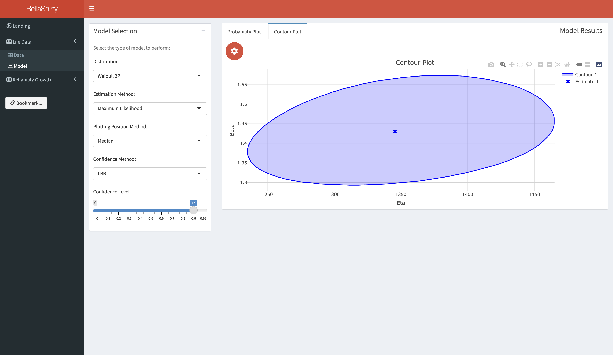

## WeibullR.shiny


WeibullR.shiny is a Shiny web application for life data analysis. This
package depends on WeibullR, a R package for Weibull analysis, and
plotly, an interactive web-based graphing library.

## Getting Started

WeibullR.shiny is still in development. To install the developmental
version in R:

``` r
devtools::install_github('paulgovan/weibullr.shiny')
```

To launch the app:

``` r
WeibullR.shiny::WeibullR.shiny()
```

## Example

### Landing

Launching the app brings up the Landing tab. From here you can access
this ReadMe, download an example dataset, or navigate to the Data tab.



### Data

For this example, we will use the example ‘Time-to-Failure’ dataset. To
access, first download the dataset locally from the Landing tab, and
then use the Data Input option in the Data tab to upload the dataset to
the app. At this point, your app should look like the image below. There
are additional options for arranging your data for analysis, but for
here we will use the default option.



### Modeling

Now click on the Modeling tab to build the model. The app will use the
default options to build a Probability Plot. Feel free to try different
options to configure the model. Below the plot are additional plot
options to configure the plot.



Finally, click on the Contour Plot tab to build a contour plot. As
before, there are other plot options for configuring the contour plot.



## More Resources

For more info on WeibullR.plotly, visit
[paulgovan.github.io/WeibullR.plotly/](paulgovan.github.io/WeibullR.plotly/)

For an interactive introduction to Life Data Analysis, check out
[WeibullR.learnr](paulgovan.github.io/WeibullR.learnr/)
